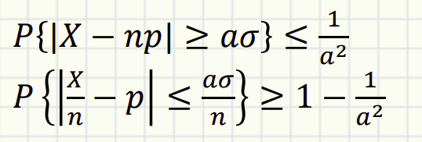
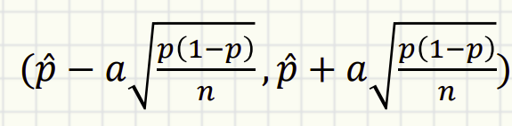
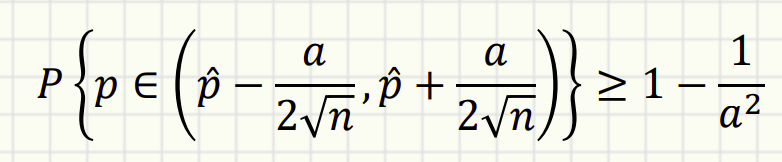
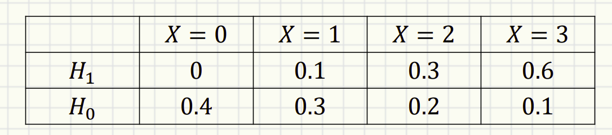

# ECE 313
- [ECE 313](#ece-313)
  - [01/20/26](#012026)
    - [TODO](#todo)
  - [01/22/26](#012226)
    - [Motivation](#motivation)
    - [Experimental Analysis](#experimental-analysis)
    - [Basic Steps to solving Problems](#basic-steps-to-solving-problems)
    - [Basic Concepts](#basic-concepts)
    - [Events](#events)
  - [01/24/26](#012426)
    - [Terminology Example](#terminology-example)
    - [Terminology](#terminology)
    - [Describing Probability](#describing-probability)
    - [Rolling Two Dice and Non-Equal Probable Sample Space](#rolling-two-dice-and-non-equal-probable-sample-space)
    - [K-Maps](#k-maps)
    - [Event Axioms](#event-axioms)
    - [Probability Axioms](#probability-axioms)
    - [Counting](#counting)
    - [Principle of Counting for Independent Experiments](#principle-of-counting-for-independent-experiments)
    - [Principle of Counting for Dependent Experiments](#principle-of-counting-for-dependent-experiments)
    - [Permutation](#permutation)
  - [01/27/26](#012726)
    - [Principle of Over Counting](#principle-of-over-counting)
    - [Combination](#combination)
    - [Sample space with infinite cardinality](#sample-space-with-infinite-cardinality)
    - [Random Variables](#random-variables)
  - [01/29/26](#012926)
    - [Probability Mass Function](#probability-mass-function)
    - [Mean](#mean)
    - [Function of RV - LOTUS](#function-of-rv---lotus)
    - [Variance and Standard Deviation](#variance-and-standard-deviation)
  - [02/03/26](#020326)
    - [Mean and Variance of Linear RV Functions](#mean-and-variance-of-linear-rv-functions)
    - [Standardized RV](#standardized-rv)
    - [Conditional Probability](#conditional-probability)
    - [Monty Hall](#monty-hall)
    - [Problem Solving for Conditional Probability](#problem-solving-for-conditional-probability)
  - [02/05/26](#020526)
    - [Law of Total Probability](#law-of-total-probability)
    - [Bayers Formula](#bayers-formula)
    - [Independent Events](#independent-events)
    - [Pairwise Independent](#pairwise-independent)
  - [02/10/26](#021026)
    - [Bernouli Distributions](#bernouli-distributions)
    - [Binomial Distribution](#binomial-distribution)
    - [Binomial Properties](#binomial-properties)
    - [Geometric Distribution](#geometric-distribution)
  - [02/12/26](#021226)
    - [Geometric Distribution Extensions](#geometric-distribution-extensions)
    - [Memoryless Property](#memoryless-property)
    - ["Best of K" Problem](#best-of-k-problem)
    - [Bernoulli Process](#bernoulli-process)
      - [Connected Distributions](#connected-distributions)
    - [Poisson Distribution ($Pois(\\lambda)$)](#poisson-distribution-poislambda)
      - [Definition](#definition)
      - [Applications](#applications)
  - [02/17/26](#021726)
    - [Markov Inequality](#markov-inequality)
    - [Chebyshev Inequality](#chebyshev-inequality)
    - [Confidence Interval](#confidence-interval)
    - [Hypothesis](#hypothesis)
    - [Maximum Likeliood Table](#maximum-likeliood-table)
  - [02/17/26](#021726-1)
    - [Inequalities](#inequalities)
    - [Markov Inequality](#markov-inequality-1)
    - [Chebyshev Inequality](#chebyshev-inequality-1)
  - [Confidence Intervals](#confidence-intervals)
    - [Maximum Likelihood Estimation (MLE)](#maximum-likelihood-estimation-mle)
    - [Binary Hypothesis Testing](#binary-hypothesis-testing)
        - [Key Definitions](#key-definitions)
    - [Decision Rules](#decision-rules)
    - [Error Metrics](#error-metrics)
    - [Reliability \& Union Bound](#reliability--union-bound)
  - [03/21/26](#032126)
    - [Probability Distributions Cheat Sheet](#probability-distributions-cheat-sheet)

## 01/20/26
- Section A is separate from the other sections
  - One less midterm
  - More in class activities and one more project
  - Find teams of three on campuswire

### TODO
- Join gradescope
- Homework
- Find team

## 01/22/26
### Motivation
- Tools to analyze computer systems and the algorithms
  - Distribution of inputs
  - Arrival patterns of tasks
  - Computer resources
- Applications in healthcare, transportation systems, smart power grid
- Probability is used to evaluate system design and performance
  - Throughput
  - Response time
  - Reliability
  - Availability

### Experimental Analysis
- Need to specify various probability distributions
- Sample space
- You can combine probabilities so long they follow the rules of probability

### Basic Steps to solving Problems
1. Identifying the sample space $S$
   1. No two elements can occur simultaneously and one element must occur on any trial
   2. All its elements ar emutually exclusive and coillectively exhaustive
2. Assign probabilities to the elements in $S$
   1. Can be assigned to individual characteristics
   2. Must be consistent with the axioms of probabilties
3. Identity the events of interests
   1. How often/how likely a certain event is going to occur
   2. Developing insight based on probabilities

### Basic Concepts
- **Random Experiment**
  - Outcome is not certain
- **Sample Space**
  - The totality of all possible outcomes
  - Any outcome will happen within the sample space
  - The chance that an outcome will occur is always greater than or equal to 1 (?)
- **Discrete**
  - Countable
  - Countably infinite
- **Continous Sample Space**

### Events
- An event is a collection of certain sample points
  - A subset of the sample space
- An event is defined as a statement whose truth or falsity is determined after the experiment
- e.g. An event is the times a coin toss results in 9 heads out of 10 throws
- The set of all outcomes for which the statement is true defines the subset of the sample space corresponding to the target event
- Elementary event is the event consisting of a single sample point
- $E$ is an event is defined in the sample space $S$
  - $E \subset S$
- Outcome of a specific trial is an element $s$
- If $s$ has occursed, $E$ has occursed
- $s$ may be an element in multiple events
  - Many events may occur
- Universal event is the entire sample space $S$
- The null set $\emptyset$ is a null or impossible event

## 01/24/26
> Section Switch
### Terminology Example
- Experiments
  - Toss a fair coin
- Outcomes
  - Heads or tail
- Trials
  - Do this $x$ times

### Terminology
- Sample Space ($\Omega$)
  - The set of possible outcomes of an experiment
- Event
  - A subset of the sameple space

### Describing Probability
- If every outcome is equally probable
  - $P(A) = \frac{|A|}{|\Omega|}$

### Rolling Two Dice and Non-Equal Probable Sample Space
- Roll two fair dices, probability of the sum being 6
- $\Omega _1 = \{2, 3, 4, ... , 12\}$
- $A _1 = \{7\}$
- We have two construct a new sample space
- $\Omega _2 = \{ [1,1], [1,2], ..., [6,6]\}$
- $A _2 = \{[1,5], [2,4]..., [5,1]\}$

### K-Maps
- Sum of the probability of all the boxes

### Event Axioms
1. $\Omega \in \mathscr{F}$ is an event
2. If $A \in \mathscr{F}$, then $A ^c \in \mathscr{F}$ 
3. If $A \in \mathscr{F}$, $B \in \mathscr{F}$, then $A \cup B \in \mathscr{F}$ 
4. $\emptyset \in \mathscr{F}$
5. If $A \in \mathscr{F}$, $B \in \mathscr{F}$, then $A \cap B \in \mathscr{F}$

### Probability Axioms
1. $\forall A \in \mathscr{F}, P(A) \leq 1$
2. If $A,B \in \mathscr{F}$ and $A,B$ are mutually exclusive then $P(A \cup B) = P(A) + P(B)$
3. $P(\Omega) = 1$
4. $P(A ^c) = 1 - P(A)$
5. $P(A \cup B) = P(A) + P(B) - P(AB)$

### Counting
- Independent Experiments
  - Toss a coin and roll a die
  - Roll a die twice
- Dependent Experiments
  - Bin of balls
  - Draw two balls
  - Pokers
> e.g. Toss a coin and roll a die
> $\Omega _c = \{H,T\}, \Omega _d = \{1,2,3,4,5,6\}$
> $\Omega = \{H1, H2, H3, ... , T1, T2...\}$
> $|\Omega| = |\Omega _c| \times |\Omega _d| = 2 \times 6 = 12$
> $|A| = |\{ H2, H4, H6, T2, T4, T6\}| = |\Omega _c| \times |A _d| = 2 \times 3 = 6$, where $A$ is the event we roll an even number on the die
- **For independent events**, $P(AB) = P(A)P(B)$

### Principle of Counting for Independent Experiments
- If there are $m$ ways to select one variable, and $n$ ways to select the other
- If these variables are selected independently
- Then there are $m \times n$ ways to make the pair of selections

### Principle of Counting for Dependent Experiments
- Drawing socks from 4 pairs of black and 2 pairs white socks
- The first draw affects the second one
- $P(\text{Draw two socks, color is the same})$
- $\Omega _1 = \{ B1, B2, ..., B8, W1, W2, ..., W4\}$
- $A=\{B1B2, B1B3, ..., B7B8, W1,W2, ..., W3W4\}$

### Permutation
- The number of ways to order $n$ different items
- How many ways can you order letters $A, B, C, D$?
  - $|A|=N!$
- What if we want to order $A, B, C, ..., G$ but only pick 4?
  - $|A|= \frac{7!}{3!}$
  - Why divide by $3!$
    - Each unique combinations of the first 4 letters would result in the permutation of $3!$ of the last 3 letters that we do not care about
- What if we want to order letters of ILLINI?
  - We have duplicates
  - $|A|= \frac{6!}{2!3!}$

## 01/27/26
### Principle of Over Counting
- What if we want to order letters of ILLINI?
  - We have duplicates
  - $|A|= \frac{6!}{2!3!}$
    - Over-counting the combinations of I and I and I, they are the same
    - Same thing with L and L
    - We don't care about the permutation of the same characters so we divide it by the duplicates

### Combination
- The number of ways to choose k out of n different items
- $C(n, k)$
- Choose means, we don't care picking orders
  - For example, choosing students out of a class, you don't care abotu the order of the picking
  - As long as in the chosen set
- ${n \choose k} = \frac{n!}{k!(n-k)!}$
  - $k!$: don't care about the k choosed orders
  - $(n-k)!$: don't care about the last items that are not chosen, they are still being ordered by the permutation
- e.g. Draw 3 balls out of 5 balls without replacement
  - ${5 \choose 3} = \frac{5!}{2!3!}$
    - $2!$ is the last two permutations that we don't care about
    - $3!$ is the ordering of the first 3 balls we drew that we don't care about
- e.g. 4 pairs of black socks and 2 pairs of white socks
  - $P(\text{Draw two socks, color is the same})$
    - $|\Omega| = {12 \choose 2}$
    - $|A| = |{A _B}| + |{A _W}| = {8 \choose 2} + {4 \choose 2}$
    - $\frac{|A|}{|\Omega|}$
- e.g. A bag contains {R, R, R, R, G, G, B}, probability of choosing 3 balls of different colour
  - $\frac{4 \times 2 \times 1}{7 \choose 3}$
- e.g. Poker
  - $\Omega _{card} = 52$
  - Full house is 3 same numbers, other 2 same numbers
  - $P(\text{FULL HOUSE}) = \frac{|A _{3kind}| \times |A _{2kind}|}{52 \choose 5}$
  - We can multiply because they are independent events
  - $|A _{3kind}| = {4 \choose 3} {13 \choose 1}$
  - $|A _{2kind}| = {4 \choose 2} {12 \choose 1}$

### Sample space with infinite cardinality
- Interval probability
- $\Omega = \{\omega: 0 \leq \omega \leq 1\},P([a,b])=b-a$
- $A=[0.2, 0.8]$
- Probability of continous intervals
  - $P(x=0.234)=0$

### Random Variables
- Rolling a die $\Omega = \{1,2,3,4,5,6\}$, event "odd" $A=\{1,3,5\}$
  - Add a coated face to the die $[1,0,1,0,1,0]$
  - Coated die X is a "random variable"
- Random Variable
  - A random variable is a real-value funtion on $\Omega$
  - e.g. Mapping head to 1 and tail to 0
  - A random variable $X$ is said to be discrete type if there's a finite/countable infinite set $\{u_1, u_2, ...\}\ s.t.\ P\{X \in \{u_1, u_2, ...\} \}$

## 01/29/26
### Probability Mass Function
- PMF
- Probability that a random variable is equal to a certain number
- $p_x(u)=P\{X=u\}$ for a discrete random variable $X$
- The sum of the probability of all outcomes is 1
- Let $X$ be the outcome of a fair die roll
  - $p_x(2)=\frac{1}{6}$
- PMF can determine probabilities of all events determined by $X$
  - e.g. fair die
    - Map even to -1 and odd to 1
    - Outcomes = {1,2,3,4,5,6}
    - X = {1,-1,1,-1,1,-1}
    - $X$ describes "even" if $X=-1$
    - $X$ does not describe multiples of 3
  - e.g.
    - Voting for favourite number
    - 1  2  3  4  5  6
    - 11 15 22 26 11 15   %
    - Not equally probably
    - $$P(\text{Roll twice and get a pair}) \newline = P([1,1]) + P([2,2]) + P([3,3]) + ... + P([6,6]) \newline = 0.11^2 + ... + 0.15^2$$
  - e.g. Let $S$ be the sum of rolling two dice
    - $S$ is a RV because it is a real value function mapping all outcome
    - $P(S=7)=\frac{6}{36}$
    - $p_s=\{2\rarr \frac{1}{36},..., 6 \rarr \frac{5}{36}, 7 \rarr \frac{6}{36},...\}$
    - $\{(T_i, T_j) | i \neq j, T_i = T_j\}$, we don't need to account for it twice is our probability PMF because it only appears once
  - e.g. Let $N$ be the # of toss until getting first tail
      - Real value function, countably finite
      - $P_N(n)=\frac{1}{2} ^n$
    - Let $M$ be the # of heads observed until getting first tail
    - $M \in [0, \infty]$
    - $P_M(m)=(\frac{1}{2}) ^{m-1}$
  - $M$ & $N$ are depedent variables to each other

### Mean
- In many cases, we don't need detailed PMF
- $\mu _x =E[X]=\Sigma_i a_i p_x(a_i)$
  - For all possible outcome of $X$, we time its outcome with its possibility
- e.g. $X$ is the number for a die roll
- $Y=2X$, $Y$ is a variable that doubles the roll of a die
- $Y \in {2,4,6,8,10,12}$
- $E[Y] = \frac{1}{6} \times 2 + \frac{1}{6} \times 4 + ... + \frac{1}{6} \times 12$
- $Z=|X-3|$
- $Z \in {0,1,2,3}$
- $E[Z]= \frac{1}{6} \times 0 + \frac{2}{6} \times 1 + \frac{2}{6} \times 2 + \frac{1}{6} \times 3 = \frac{3}{2}$

### Function of RV - LOTUS
- $E[g(x)]=\Sigma g(x)p(x)$
- e.g. $X$ is RV uniformly sampled from {-1,0,1,2,3}
  - $p_X(x)=\frac{1}{5}$
  - $Y=X^2$
  - $E[g(x)]=\Sigma g(x)p(x)$
  - $Y=g(x)=\{1,0,1,4,9\}$
  - $E[Y]=\frac{1}{5} \times 1 + \frac{1}{5} \times 0 + \frac{1}{5} \times 1 + \frac{1}{5} \times 4 + \frac{1}{5} \times 9$
- e.g. $X$ is rolling a D6, $Y$ is rolling a D8
- $E[XY]=\Sigma x\cdot y \cdot p(x)p(y)$
- $= xy \frac{1}{6} \frac{1}{8}$
- $= \frac{1}{48} (1+2+3+4+5+6)(1+2+3+4+5+6+7+8)$

### Variance and Standard Deviation
- Variance is how PMF spreads apart from the mean
- $Var(x) \triangleq E[(x-\mu_x)^2]=E[X^2]-(E[X])^2$
- $(x-\mu_x)^2$ is the deviation
- $E[(x-\mu_x)^2] = E[X^2 - 2\mu _x X + \mu _x ^2] = E[X^2]-2\mu_x E[X]+\mu_x^2=E[X^2]-2\mu_x^2+\mu_x^2$
- Standard deviation $\sigma = \sqrt{Var(X)}$
- $Var(X+c) = Var(X)$
- $Var(aX+c) = a^2\times Var(X)$
- e.g. Do you want your monthly salary to be
  - $p_x(10K)=1$
  - $p_y(0)=0.99,p_y(1000K)=0.01$
  - Same expectation
  - What if it's bonus?

## 02/03/26
### Mean and Variance of Linear RV Functions
- Always True:
- $E[aX+b]=a\mu _x + b$
- $E[X+Y]=\mu _x + \mu _y$
- $Var(aX+b) a ^2 Var(X)$
- $\sigma_{aX+b}=a \sigma _X$
- e.g.
  - A is rolling a die twice and sum the results
  - B is rolling the same die once multiply the result by 2
  - $p_a(k) \not = p_b(k)$
    - Not the same possible outcomes
  - $E[A] = E[B]$
    - The same expectations
  - $Var(A)=Var(B)$
  - $Var(A)=Var(X_1 + X_2)$
  - $Var(B)=Var(2X_1)$

### Standardized RV
- For any RV X
  - $\frac{X-\mu _x}{\sigma _x}$ is a standardized RV - mean 0, variance 1
  - $E[X-\mu_x]=\mu_x - \mu_x$
  - $Var(\frac{X-\mu _x}{\sigma _x})=Var(\frac{X}{\sigma _x})=(\frac{1}{\sigma_x})^2 Var(X)=\frac{\sigma ^2}{\sigma ^2}$

### Conditional Probability
- The probability of B happens given that A happens
- $P(B|A) + P(B^c|A) = 1$
- $P(\Omega | A) = 1$
- $P(AB)=P(A|B)P(B)$
- $P(ABC)=P(A|BC)P(B|C)P(C)$
- $P(\text{pair of socks are same color) given} S_1 = B$
- e.g.
  - Roll two dice, A is sum is 6, B is numbers are not equal
  - $P(B|A) = P(AB)/P(A)$

### Monty Hall
- Let $X_i$ denote i-th choice
- Never change, W is win rate, NC is never change
  - $P(W|NC)=P(W|X_2=X_1)=P(X_1=Car) = \frac{1}{3}$
- Change
  - $P(W|C)=P(W|X_2 \not =X_1)=P(X_1=Goat)$

### Problem Solving for Conditional Probability
- $P(A|B) \rArr \text{Is } AB \text{ separable from }B?$
  - Yes
    - $P(\text{FULL HOUSE} | \text{Already have 3 of a kind})$
      - We already know we have 3 of a kind, we only have to consider the last two cards
    - $P(A|B)$ directly since we only have to consider the last two cards
  - No
    - $P(\text{FULL HOUSE} | C_1, C_2\text{ are diff suits})$
    - $\frac{P(AB)}{P(B)}$

## 02/05/26
### Law of Total Probability
- There are 3 dice, A, B, C
- $A = [R, B, B, B, B, B]$
- $B = [R, R, B, B, B, B]$
- $C = [R, R, R, B, B, B]$
- Draw one die and roll many times
  - Drawing one die and rolling red
    - $P(R_1) = P(R_1 A) + P(R_1 B) + P(R_1 C)$
    - $P(R_1 A) = P(R_1 | A) P(A) = \frac{1}{6} \times \frac{1}{3}$
      - A, B, C are partitions and mutually exclusive so we can add their probabilities
  - Drawing two dies and rolling two reds
    - $P(R2|R1) = \frac{P(R_2R_1)}{P(R_1)}\newline=\frac{P(R_2R_1)}{\frac{1}{3}}\newline=3\times[P(R_2R_1|A)P(A)+P(R_2R_1|B)P(B)+P(R_2R_1|C)P(C)]$

### Bayers Formula
- Conditional Probability + Law of Total Probability
  - How do we get $P(B|A)$ from $P(A|B)$
  - $P(B|A)=\frac{P(AB)}{P(A)}=\frac{P(A|B)P(B)}{P(A)}$
  - $P(E_i|A)=\frac{P(E_iB)}{P(A)}=\frac{P(A|E_i)P(E_i)}{\Sigma P(A|E_j)P(E_j)}$
- e.g.
- Assume there is a disease $A$ and the corresponding test $T$
  - $P(T|A)=0.9$
    - Probability of test positive given someone has disease
  - $P(T|A^c)=0.05$
    - Probability of test positive given someone is healthy
  - $P(A)=0.01$
    - Probability of someone having the disease in general
  - $P(A|T)=\frac{P(T|A)P(A)}{P(T)}=\frac{P(T|A)P(A)}{P(T|A)P(A)+P(T|A^c)P(A^c)}$
    - Using parititions
- e.g.
  - 18% of adults are smokers
  - 15% of women are smokers
  - Population = 50% men + 50% women
  - What fraction of adult smokers are women?
    - $P(S)=0.18$
    - $P(S|W)=0.15$
    - $P(W^c)=0.5$
    - $P(W)=0.5$
    - $P(W|S)=\frac{P(S|W)P(W)}{P(S)}$
  - 15% of women are smokers
  - Compared to nonsmokers, women wo smoke are 13 times more likely to get lung cancer
    - $P(C|W,S)=13*P(C|W,S^c)= 13*L$
  - If I pick a female lung cancer patient, how likely she is a smoker?
    - $P(S|W,C)$
    - Since it's only on women, no need to include $W$ as a condition
    - $P(S|C)=\frac{P(C|S)P(S)}{P(C)}=\frac{13*L*0.15}{P(C|S^c)P(S^c)+P(C|S)P(S)}$

### Independent Events
- A and B are events that are mutually independent if
  - $P(B|A)=P(B)$ or 
  - $P(AB)=P(A)P(B)$
- RVs $X$ and $Y$ are independent if $A$ and $B$ are independent for any $X\in A$ $Y \in B$
- $P(AB)=P(A)P(B)$ factiruze the pmf
  - Compute the pmf easily
- Decide the model complexity
  - What really affects the results?
- e.g.
  - Physically independence - toss a coin and roll a die $(N,X)$
    - By linguistic definition, they are indepedent
  - Probabilistic independence
    - $A \triangleq even(X)$
    - $B \triangleq \{X \equiv 0 (mod\ 3) \}$

### Pairwise Independent
- Toss coin twice
  - A is first coin is head
  - B is second coin is head
  - C is toss results are the same
- They are only independent if
  - $P(ABC)=P(A)P(B)P(C)$

## 02/10/26
### Bernouli Distributions
- $X$ is Bernouli distribution with parameter $p$ if
  - $P\{X=1\}=p and P\{X=0\}=1-p$
  - "Toss a coin with p probability head"
  - Only 2 possible outcomes, $pmf$ contains 2 bins
  - $E[X]=1*p_x(1)+0*p_x(0)=p$
  - $E[X^2]=1^2*p_x(1)+0^2*p_x(0)=p$
  - $Var(x)=\sigma_x^2 = p(1-p)$

### Binomial Distribution
- $X$ is binomial distribution with parameter $(n,p)$ if
  - $X$ is sum of $n$ Bernouli trials with parameter $p$
  - Toss the coin $n$ times and count the head
  - $p_x(k)= {n \choose k} p^k (1-p)^{n-k}$
  - $p^k$ is the chance you get k heads
  - $(1-p)^{n-k}$ is the chance the rest are tails
  - $n \choose k$ is how many different combinations of the two scenarios in a sequence with no duplicates

### Binomial Properties
- $E[X]=np$
- $Var(X)=n \times Var(Bern(p)) = np (1-p)$
  - n tosses are independent experiments
- What is the most likely k
  - $k^*=\lfloor (n+1) p \rfloor$

### Geometric Distribution
- number of toss on a coin until the first head is shown
- $L = \text{number of trials until we get the first }1$
- $p_L(1)=p$
- $p_L(2)=p(1-p)$
- $p_L(k)=p(1-p)^{k-1}$
- $p\{L>k\}=(1-p)^k$
- Mean
  - $E[L]=\frac{1}{p}$
- Variance
  - $Var(L)=E[L^2]-\mu _L ^2=\frac{1-p}{p^2}$
- e.g. What's the expected number of rolls to get 1 to 6 at least once?
  - $R_k$ is the number of rolls to get the $k$-th unseen number
  - $R_1=1$, since it's the first roll
  - $R_2=Geo(p=\frac{5}{6})$, treat the die as coated, the one we've already seen treat as coin head and the other as coin tail, and we want the geometric distribution of the first roll we see the tail
  - $R_3=Geo(p=\frac{4}{6})$
  - $R_4=Geo(p=\frac{3}{6})$
  - ...
  - $\sum_{k=1}^6 R_k$

## 02/12/26
### Geometric Distribution Extensions
Focuses on the number of trials needed to achieve the first success.

### Memoryless Property
The probability of needing $k$ more trials does not depend on how many failures have already occurred. Past failures do not affect the future waiting time.
*   **Concept:** "Failing 10 times will not affect the 11-th trial."
*   **Formula:**
    $$P(L > n + k | L > n) = P(L > k)$$
*   **Expected Value:** If you have already failed $n$ times, the expected *total* number of trials is the current count plus the original expectation.
    $$E[Total | \text{failed } n \text{ times}] = n + E[L] = n + \frac{1}{p}$$

### "Best of K" Problem
calculating the probability of a series ending in a specific number of games (e.g., Best of 7).
*   **Condition:** For a series to end at game $Y=k$ with a specific winner (e.g., Team A), that team must win their final required game *exactly* at step $k$.
*   **Calculation Logic:**
    $$P(Y=k) = P(\text{A wins at } k) + P(\text{B wins at } k)$$
    Where $P(\text{A wins at } k)$ implies A won $N_{win}-1$ games in the first $k-1$ trials, and won the $k$-th trial.

---

### Bernoulli Process
An infinite sequence of independent Bernoulli trials $X_1, X_2, \dots$ where $X_k \sim Bern(p)$.

#### Connected Distributions
The Bernoulli process unifies several distributions based on what you are counting:
1.  **Bernoulli:** $X_k$ (Outcome of the $k$-th trial).
2.  **Binomial:** $C_k$ (Number of successes in first $k$ trials).
    $$C_k \sim Bin(k, p)$$
3.  **Geometric:** $L_1$ (Number of trials to get the **1st** success).
    $$L_1 \sim Geo(p)$$
4.  **Negative Binomial:** $S_r$ (Number of trials to get the **$r$-th** success).
    *   **Definition:** Sum of $r$ independent geometric variables.
    *   **PMF Formula (Prob of $n$ trials for $r$ successes):**
        $$P(S_r = n) = \binom{n-1}{r-1} p^r (1-p)^{n-r}$$
        *(Logic: We need $r-1$ successes in the first $n-1$ trials, and a success on the $n$-th trial).*

---

### Poisson Distribution ($Pois(\lambda)$)
Used to model the number of events occurring in a fixed interval when events are rare but trials are many.

#### Definition
A limiting case of the Binomial distribution where $n \to \infty$ and $p \to 0$, but the rate $\lambda = np$ remains constant.
*   **PMF Formula:**
    $$P_X(k) = \frac{e^{-\lambda}\lambda^k}{k!}$$
*   **Key Parameters:**
    *   **Mean:** $E[X] = \lambda$
    *   **Variance:** $Var(X) = \lambda$

#### Applications
*   **Approximation:** calculating probabilities for Binomial distributions when $n$ is very large (e.g., $10^4$) and $p$ is very small (e.g., $10^{-4}$).
*   **Example (Bit Errors):**
    *   If observing a 10MB file ($n = 8 \times 10^7$ bits) with error rate $10^{-4}$, the number of errors $Y$ is approximated by $Pois(\lambda)$ where $\lambda = np = 8000$.

## 02/17/26
### Markov Inequality
- $P(Y \geq c) \leq \frac{E[Y]}{c}$
- $p_y(0)+p_y(c)=1$
- e.g. Throw 200 balls into 100 bins. At most how many bins can contact more than 5 balls
  - Markov

### Chebyshev Inequality
- Give information regarding the variance
  - If X is a RV for d>0
  - $p_y(0)+p_y(c)=1$
  - $P\{|X-\mu_x| \geq d \} \leq \frac{\sigma_x^2}{d^2}$
  - $P\{|X-\mu_x| \geq a \sigma_x \} \leq \frac{1}{a^2}$

### Confidence Interval
- How close is our estimate $\hat p$ to the real parameter $p$?
  - Do a poll of 200 people 
    - $X$ denotes number of people agree
    - $X ~ Bi(n=200, p)$
    - $\hat p = \frac{X}{n} \neq p$
    - 
    - 
    - $p \in \hat p \plusmn \frac{a \sigma}{n}$
    - 

### Hypothesis
- Given two hypotheses $H_1$ and $H_0$ where $H_0=H_1^c$
- Decision Rule
  - Decide $H_1$ or $H_0$ given $X$
  - How to pick the best rule?

### Maximum Likeliood Table
- Table showing the likelihood of two hypotheses
- 
  - Row sum up to one
- $P(false\ alarm)=P(Claim H_1 | H_0)$
- $P(miss)=P(Claim H_0 | H_1)$

## 02/17/26
### Inequalities
Used to bound probabilities when the exact distribution is difficult to calculate.

### Markov Inequality
Applies to **non-negative** random variables only.
*   **Formula:** For a non-negative random variable $Y$ and constant $c > 0$:
    $$P(Y \ge c) \le \frac{E[Y]}{c}$$
*   **Usage:** Bounding the probability of a value exceeding a threshold based solely on the mean.

### Chebyshev Inequality
Applies to any random variable with a defined mean and variance. Measures deviation from the mean.
*   **Formula (Distance $d$):**
    $$P(|X - \mu_X| \ge d) \le \frac{\sigma_X^2}{d^2}$$
*   **Formula (Standard Deviations $a$):**
    $$P(|X - \mu_X| \ge a\sigma_X) \le \frac{1}{a^2}$$

---

## Confidence Intervals
Estimating how close an observed sample mean/proportion $\hat{p}$ is to the true parameter $p$.

*   **Definition:** An interval centered on the estimate $\hat{p}$ that contains the true parameter $p$ with a certain probability (confidence level).
    $$(\hat{p} - \frac{a\sqrt{p(1-p)}}{\sqrt{n}}, \hat{p} + \frac{a\sqrt{p(1-p)}}{\sqrt{n}})$$
*   **Conservative Bound:** Since $p$ is unknown, we use the maximum variance of a Bernoulli trial ($p=0.5$) where $p(1-p) \le 0.25$.
    $$P\left(p \in \left[\hat{p} - \frac{a}{2\sqrt{n}}, \hat{p} + \frac{a}{2\sqrt{n}}\right]\right) \ge 1 - \frac{1}{a^2}$$
*   **Sample Size Calculation:** To find the sample size $n$ needed for a specific margin of error $\epsilon$ and confidence level $(1 - \frac{1}{a^2})$:
    $$\epsilon = \frac{a}{2\sqrt{n}} \implies n = \frac{a^2}{4\epsilon^2}$$

---

### Maximum Likelihood Estimation (MLE)
Method to estimate a parameter $\theta$ based on observation $k$.

*   **Definition:** Find the parameter value that makes the observed data most probable.
*   **Formula:**
    $$\hat{\theta}_{MLE} = \arg\max_\theta P(k|\theta)$$
*   **Process:** Calculate the likelihood $P(X=k)$ for valid $\theta$ values and choose the one that yields the maximum value.

---

### Binary Hypothesis Testing
Deciding between two hypotheses ($H_0, H_1$) based on observation $X$.

##### Key Definitions
*   **Priors ($\pi$):** Probability of a hypothesis before observation.
    *   $\pi_0 = P(H_0)$
    *   $\pi_1 = P(H_1)$
*   **Likelihood:** $P(X|H_i)$ (Probability of observation given hypothesis).
*   **Posterior:** $P(H_i|X)$ (Probability of hypothesis given observation).
*   **Joint Probability:** $P(H, X) = P(X|H)P(H)$.

### Decision Rules
1.  **Maximum Likelihood (ML) Rule:**
    *   Ignore priors. Choose the hypothesis that maximizes the likelihood.
    *   Rule: Claim $H_1$ if $P(X|H_1) > P(X|H_0)$.
    *   **Likelihood Ratio Test (LRT):** Equivalent to checking if $\Lambda(k) = \frac{P(X|H_1)}{P(X|H_0)} > 1$.

2.  **Maximum A Posteriori (MAP) Rule:**
    *   Incorporates priors to minimize total error. Maximize the posterior (or joint) probability.
    *   Rule: Claim $H_1$ if $P(X|H_1)\pi_1 > P(X|H_0)\pi_0$.
    *   **LRT Formulation:** Equivalent to LRT with threshold $\tau$:
        $$\frac{P(X|H_1)}{P(X|H_0)} > \frac{\pi_0}{\pi_1}$$

### Error Metrics
*   **False Alarm:** Deciding $H_1$ when $H_0$ is actually true.
    $$P_{false\_alarm} = P(\text{Claim } H_1 | H_0) = \sum_{k \in R_1} P(X=k|H_0)$$
*   **Miss:** Deciding $H_0$ when $H_1$ is actually true.
    $$P_{miss} = P(\text{Claim } H_0 | H_1) = \sum_{k \in R_0} P(X=k|H_1)$$

---

### Reliability & Union Bound
Tools for estimating system failure probabilities.

*   **Union Bound:** Approximate the probability of a union of events (sum of probabilities is an upper bound). Useful for rare events.
    $$P(\cup A_i) \le \sum_i P(A_i)$$

---
## 03/21/26
### Probability Distributions Cheat Sheet
| Distribution | PMF / PDF | CDF (Running Total) | Expected Value & Variance | Real-World Example |
| :--- | :--- | :--- | :--- | :--- |
| **Uniform** *(Continuous)* | $f(x) = \frac{1}{b-a}$  *(for $a \le x \le b$)* | $F(x) = \frac{x-a}{b-a}$ | **$E[X]$:** $\frac{a+b}{2}$  **Var:** $\frac{(b-a)^2}{12}$ | Waiting for a subway train that arrives exactly every 15 minutes, when you arrive at the platform at a completely random time. |
| **Poisson** *(Discrete)* | $P(X=k) = \frac{e^{-\lambda}\lambda^k}{k!}$ | $P(X \le k) = \sum_{i=0}^k \frac{e^{-\lambda}\lambda^i}{i!}$ | **$E[X]$:** $\lambda$  **Var:** $\lambda$ | Counting the exact number of emails that arrive in your inbox between 9:00 AM and 10:00 AM. |
| **Exponential** *(Continuous)* | $f(x) = \lambda e^{-\lambda x}$  *(for $x \ge 0$)* | $F(x) = 1 - e^{-\lambda x}$ | **$E[X]$:** $\frac{1}{\lambda}$  **Var:** $\frac{1}{\lambda^2}$ | Measuring the amount of time you have to wait until the *very next* customer walks into a coffee shop. |
| **Erlang** *(Continuous)* | $f(x) = \frac{\lambda^n x^{n-1} e^{-\lambda x}}{(n-1)!}$  *(for $x \ge 0$)* | $F(x) = 1 - \sum_{i=0}^{n-1} \frac{e^{-\lambda x}(\lambda x)^i}{i!}$ | **$E[X]$:** $\frac{n}{\lambda}$  **Var:** $\frac{n}{\lambda^2}$ | Measuring the total amount of time it takes for exactly *5* customers to walk into that same coffee shop. |